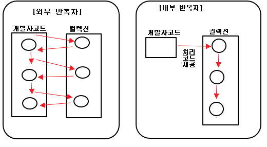
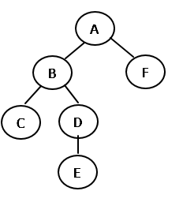

## Java Test!

### Index

- <a href="#reflection">Reflection</a>
- <a href="#stream">Stream</a>
- <a href="#blockingQueue">BlockingQueue : Producer, Consumer </a>
- <a href="#tree"> Simple Tree </a>


<div id="reflection"></div>

### Reflection

#### Display Class Inform (Methods, Field, Annotation)

> ReflectionTestDoamin.java

```aidl
package domain;

import annotation.ReflectionAnnotataion;
import java.util.List;

public class ReflectionTestDomain {

    @ReflectionAnnotataion
    private String name;
    private int age;
    private List<String> hobbies;
    private String job;

    public String getName() {
        return name;
    }

    public void setName(String name) {
        this.name = name;
    }

    public int getAge() {
        return age;
    }

    public void setAge(int age) {
        this.age = age;
    }

    public List<String> getHobbies() {
        return hobbies;
    }

    public void setHobbies(List<String> hobbies) {
        this.hobbies = hobbies;
    }

    public String getJob() {
        return job;
    }

    public void setJob(String job) {

        this.job = job;
    }

    @Override
    public String toString() {
        String hobbiesVals = "";
        if (hobbies == null) {
            hobbiesVals = "null";
        } else {
            for (String hobby : hobbies) {
                hobbiesVals += hobby + " ";
            }
        }
        return "ReflectionTestDomain{" +
            "name='" + name + '\'' +
            ", age=" + age +
            ", hobbies=" + hobbiesVals +
            ", job='" + job + '\'' +
            '}';
    }
}
```

> ReflectionAnnotataion.java

```aidl
package annotation;

import java.lang.annotation.ElementType;
import java.lang.annotation.Retention;
import java.lang.annotation.RetentionPolicy;
import java.lang.annotation.Target;

@Target(ElementType.FIELD)
@Retention(RetentionPolicy.RUNTIME)
public @interface ReflectionAnnotataion {

    String value() default "default-value";
}
```

> Display  

```aidl
package reflection;

import domain.ReflectionTestDomain;
import java.lang.annotation.Annotation;
import java.lang.reflect.Field;
import java.lang.reflect.Method;
import java.lang.reflect.Type;
import org.junit.Test;
import util.CustomPrinter;

public class ClassMetaDataTest {

    @Test
    public void display() {
        Class clazz = ReflectionTestDomain.class;
        Method[] methods = clazz.getDeclaredMethods();
        CustomPrinter.println("## Display Methods");
        for (Method method : methods) {
            String methodName = "## " + method.getName();
            Class[] params = method.getParameterTypes();
            Annotation[] annotations = method.getAnnotations();
            String annotationVals = " annotations : " + getAnnotationInfo(annotations);
            String paramVals = "(";
            for (Class param : params) {
                paramVals += (param.getName() + ", ");
            }
            if (params.length > 0) {
                paramVals = paramVals.substring(0, paramVals.length() - 2);
            }
            paramVals += ")";
            CustomPrinter.println(methodName + paramVals + annotationVals);
        }
        CustomPrinter.println("#######################################");

        CustomPrinter.println("## Display Fields");
        Field[] fields = clazz.getDeclaredFields();
        for (Field field : fields) {
            Annotation[] annotations = field.getAnnotations();
            String annotationVals = getAnnotationInfo(annotations);
            CustomPrinter.println("## name : {}, class name : {}, annotation : {}", field.getName(), field.getType().getName(), annotationVals);
        }
        CustomPrinter.println("#######################################");
    }

    private String getAnnotationInfo(Annotation[] annotations) {
        String annotationVals = null;
        if (annotations.length == 0) {
            annotationVals = "empty";
        } else {
            annotationVals = "";
        }

        for (Annotation annotation : annotations) {
            annotationVals += annotation.annotationType().getName() + " ";
        }
        return annotationVals;
    }
}
```

> Result

```aidl
## Display Methods
## toString() annotations : empty
## getName() annotations : empty
## setName(java.lang.String) annotations : empty
## getAge() annotations : empty
## getHobbies() annotations : empty
## setJob(java.lang.String) annotations : empty
## getJob() annotations : empty
## setHobbies(java.util.List) annotations : empty
## setAge(int) annotations : empty
#######################################
## Display Fields
## name : name, class name : java.lang.String, annotation : org.springframework.lang.Nullable
## name : age, class name : int, annotation : empty
## name : hobbies, class name : java.util.List, annotation : empty
## name : job, class name : java.lang.String, annotation : empty
#######################################
```

> Dynamic Instance by using reflection

```aidl
    @Test
    public void createInstanceByUsingReflection() {
        try {
            Class clazz = ReflectionTestDomain.class;
            // create default instance
            ReflectionTestDomain inst = (ReflectionTestDomain) clazz.newInstance();
            Field[] fields = clazz.getDeclaredFields();
            for (Field field : fields) {
                // check annotation!
                ReflectionAnnotataion annotation = field.getAnnotation(ReflectionAnnotataion.class);
                field.setAccessible(true);
                if (annotation != null) {
                    field.set(inst, annotation.value());
                } else {
                    // check generic type such as List<String>
                    Type genericType = field.getGenericType();
                    if (genericType instanceof ParameterizedType) {
                        if (field.getType().isAssignableFrom(java.util.List.class)) {
                            ParameterizedType types = (ParameterizedType) genericType;
                            Type type = types.getActualTypeArguments()[0];
                            Object value = getValue(Class.forName(type.getTypeName()));
                            List list = new ArrayList();
                            list.add(value);
                            field.set(inst, list);
                        }
                    } else {
                        field.set(inst, getValue(field.getType()));
                    }
                }
            }
            CustomPrinter.println("## Dynamic instance : " + inst.toString());
        } catch (InstantiationException e) {
            e.printStackTrace();
        } catch (IllegalAccessException e) {
            e.printStackTrace();
        } catch (ClassNotFoundException e) {
            e.printStackTrace();
        }
    }
```

> Result

```aidl
## Dynamic instance : ReflectionTestDomain{name='default-value', age=10, hobbies=Default value! , job='Default value!'}
```

---

<div id="stream"></div>

## Stream  

- ref : http://book.naver.com/bookdb/book_detail.nhn?bid=8589375

> 람다식으로 요소를 처리

```
System.out.println("== Iterator ==");
List<String> list = Arrays.asList("value1", "value2", "value3");
Iterator<String> itr = list.iterator();
while (itr.hasNext()) {
    System.out.println(itr.next());
}

System.out.println("== Stream ==");
Stream<String> stream = list.stream();
stream.forEach(name -> {
    System.out.println(name);
});
```



> parallelStream : 병렬 처리가 쉬움

```
public class StreamDefault {

    List<String> defaultList;

    @Before
    public void setUp() {
        defaultList = Arrays.asList("value1", "value2", "value3");
    }    

    @Test
    public void parallelStream() {
        Stream<String> parallelStream = defaultList.parallelStream();
        parallelStream.forEach(name -> {
            CustomPrinter.println("value : {}, current thread name : {}", name, Thread.currentThread().getName());
        });
    }

}
```

> Result

```
value : value2, current thread name : main
value : value3, current thread name : ForkJoinPool.commonPool-worker-2
value : value1, current thread name : ForkJoinPool.commonPool-worker-1
```

> 중간처리(매핑, 필터링, 정렬), 최종 처리(반복, 카운팅, 평균, 총합)등의 집계 처리  

> Filter

```
package stream;

import java.util.ArrayList;
import java.util.Arrays;
import java.util.List;
import org.junit.Before;
import org.junit.Test;

public class StreamFilter {

    List<Student> students;

    @Before
    public void setUp() {
        students = new ArrayList<>();
        for (int i = 1; i <= 10; i++) {
            students.add(new Student("name" + i, i));
        }
    }

    @Test
    public void mapToInt() {
        double average = students.stream().mapToInt(student -> {
            return student.getScore();
        }).average().getAsDouble();
        System.out.println(average);
    }

    @Test
    public void filter() {
        int sum = students.stream().filter(stu -> {
            return stu.getScore() % 2 == 0;
        }).mapToInt(Student::getScore).sum();
        System.out.println("Sum of even scores : " + sum);
    }
}
```

> Result  

```
Sum of even scores : 30
```

> Distinct  

```
@Test
public void distict() {
    List<String> names = Arrays.asList("aaa", "bbb", "ccc", "aaa");
    names.stream().distinct().forEach(name -> System.out.println(name));
}
```

> Result  

```
aaa
bbb
ccc
```

> Flatmap : 요소를 대체하는 복수 개의 요소로 구성 된 새로운 스트림 반환  

```
@Test
public void flatMap() {
    List<String> values = Arrays.asList("token1 token2", "token3", "token4 token5");
    values.stream().flatMap(data -> {
        System.out.println("check : " + data);
        return Arrays.stream(data.split(" "));
    }).forEach(token -> System.out.println(token));
}
```

> Result  

```
check : token1 token2
token1
token2
check : token3
token3
check : token4 token5
token4
token5
```

> mapXXX() : 요소를 대체하는 요소로 구성 된 새로운 스트림  

```
package stream;

import java.util.Arrays;
import java.util.List;
import org.junit.Before;
import org.junit.Test;

public class StreamFilter {

    List<Student> students;

    @Before
    public void setUp() {
        students = Arrays.asList(new Student("name1", 10), new Student("name2", 30), new Student("name3", 20));
    }

    @Test
    public void mapToInt() {
        double average = students.stream().mapToInt(student -> {
            return student.getScore();
        }).average().getAsDouble();
        System.out.println(average);
    }
}
```

> Result  

```
20.0
```

> asXXXStream(), boxex(), XXX : int, long, double  

```
@Test
public void asXXXStream() {
    int[] intArr = new int[]{1, 2, 3};
    Arrays.stream(intArr).asDoubleStream().forEach(doubleVal -> System.out.print(doubleVal + " "));
    System.out.println();
    Arrays.stream(intArr).boxed().forEach(integerInst -> System.out.print(integerInst.intValue() + " "));
}
```

```
1.0 2.0 3.0
1 2 3
```

---

<div id="blockingQueue"></div>

## BlockingQueue TEST

> Producer.java  

```aidl
package blockingqueue;

import java.util.UUID;
import java.util.concurrent.BlockingQueue;
import util.SimpleLogger;

public class Producer implements Runnable {

    private BlockingQueue<String> que;

    public Producer(BlockingQueue<String> que) {
        this.que = que;
    }

    @Override
    public void run() {
        int i = 1;
        while (true) {
            try {
                String message = "message" + (i++);                
                long wait = (long) (Math.random() * 8000L) + 3000L;
                SimpleLogger.info("Try to produce.... message : {}, next wait : {}", message, wait);
                que.add(message);
                Thread.sleep(wait);
            } catch (Exception e) {
                SimpleLogger.error("error", e);
            }
        }
    }
}
```

> Consumer.java  

```aidl
package blockingqueue;

import java.util.concurrent.BlockingQueue;
import util.SimpleLogger;

public class Consumer implements Runnable {

    private BlockingQueue<String> que;

    public Consumer(BlockingQueue<String> que) {
        this.que = que;
    }

    @Override
    public void run() {
        while (true) {
            try {
                SimpleLogger.info("Before consume(que.take())...");
                String msg = que.take();
                SimpleLogger.info("After consum(que.take()) :: message : {}", msg);
            } catch (Exception e) {
                SimpleLogger.error("error", e);
            }
        }
    }
}
```

> Runner(MAIN)

```aidl
package blockingqueue;

import java.util.concurrent.BlockingQueue;
import java.util.concurrent.LinkedBlockingQueue;

public class Runner {

    public static void main(String[] args) {
        BlockingQueue queue = new LinkedBlockingQueue();
        Thread produce = new Thread(new Producer(queue));
        Thread consume = new Thread(new Consumer(queue));
        produce.start();
        consume.start();
    }
}
```

> Result  

```aidl
180209 00:04:50.921 : blockingqueue.Producer Try to produce.... message : message1, next wait : 8840
180209 00:04:50.922 : blockingqueue.Consumer Before consume(que.take())...
180209 00:04:50.922 : blockingqueue.Consumer After consum(que.take()) :: message : message1, thread : Thread-1
180209 00:04:50.922 : blockingqueue.Consumer Before consume(que.take())...
180209 00:04:51.922 : blockingqueue.Producer Try to produce.... message : message2, next wait : 5182
180209 00:04:51.922 : blockingqueue.Consumer After consum(que.take()) :: message : message2, thread : Thread-1
180209 00:04:51.922 : blockingqueue.Consumer Before consume(que.take())...
180209 00:04:52.923 : blockingqueue.Producer Try to produce.... message : message3, next wait : 8344
180209 00:04:52.923 : blockingqueue.Consumer After consum(que.take()) :: message : message3, thread : Thread-1
180209 00:04:52.923 : blockingqueue.Consumer Before consume(que.take())...
180209 00:04:53.924 : blockingqueue.Producer Try to produce.... message : message4, next wait : 10651
180209 00:04:53.924 : blockingqueue.Consumer After consum(que.take()) :: message : message4, thread : Thread-1
180209 00:04:53.925 : blockingqueue.Consumer Before consume(que.take())...
```

---

<div id="tree"></div>

## Simple Tree  

Simple tree for tracing method call stack :)  

> SimpleNode<T>

```
package tree;

import java.util.ArrayList;
import java.util.List;

/**
 * @author zaccoding
 * github : https://github.com/zacscoding
 */
public class SimpleNode<T> {

    private List<SimpleNode<T>> children;
    private SimpleNode<T> parent = null;
    private T data = null;
    private int deps;

    public SimpleNode(T data) {
        this.data = data;
    }

    public SimpleNode(T data, SimpleNode<T> parent) {
        this.data = data;
        this.parent = parent;
    }

    public List<SimpleNode<T>> getChildren() {
        return children;
    }

    public void setParent(SimpleNode<T> parent) {
        this.parent = parent;
    }

    public void addChild(SimpleNode<T> child) {
        child.setParent(this);

        if (this.children == null) {
            this.children = new ArrayList<SimpleNode<T>>();
        }

        this.children.add(child);
    }

    public SimpleNode<T> getParent() {
        return this.parent;
    }

    public T getData() {
        return this.data;
    }

    public void setData(T data) {
        this.data = data;
    }

    public boolean isRoot() {
        return (this.parent == null);
    }

    public boolean isLeaf() {
        if (this.children == null || this.children.size() == 0) {
            return true;
        } else {
            return false;
        }
    }

    public void removeParent() {
        this.parent = null;
    }

    public int getDeps() {
        return deps;
    }

    public void setDeps(int deps) {
        this.deps = deps;
    }
}
```

> SimpleTree<T>  

```
package tree;

import java.util.List;
import java.util.function.Consumer;

/**
 * @author zaccoding
 * github : https://github.com/zacscoding
 */
public class SimpleTreeImpl<T> implements SimpleTree<T> {

    private SimpleNode<T> root;
    private SimpleNode<T> current;

    @Override
    public void add(T t) {
        if (root == null) {
            root = new SimpleNode<>(t);
            current = root;
        } else {
            if (current != null) {
                SimpleNode<T> newNode = new SimpleNode<T>(t);
                current.addChild(newNode);
                current = newNode;
            } else {
                System.out.println("Current is null!!");
            }
        }
    }

    @Override
    public void complete() {
        if (current != null) {
            current = current.getParent();
        }
    }

    @Override
    public SimpleNode<T> getRoot() {
        return root;
    }

    @Override
    public SimpleNode<T> getCurrentNode() {
        return current == null ? null : current;
    }

    @Override
    public T getCurrentData() {
        return current == null ? null : current.getData();
    }

    @Override
    public void traversal(Traversal type, Consumer<SimpleNode<T>> consumer) {
        prefixTraversal(type, 0, this.root, consumer);
    }

    private void prefixTraversal(Traversal type, int depth, SimpleNode<T> node, Consumer<SimpleNode<T>> consumer) {
        if (node == null) {
            return;
        }

        node.setDeps(depth);
        if (type == Traversal.PREFIX) {
            consumer.accept(node);
        }

        List<SimpleNode<T>> childs = node.getChildren();

        if (childs != null && childs.size() > 0) {
            for (SimpleNode<T> child : childs) {
                prefixTraversal(type, depth + 1, child, consumer);
            }
        }

        if (type == Traversal.SUFFIX) {
            consumer.accept(node);
        }
    }
}
```

> TEST

```
    @Test
    public void traversal() {
        SimpleTree<String> tree = new SimpleTreeImpl<>();
        tree.add("A");
        tree.add("B");
        tree.add("C");
        // complete C
        tree.complete();
        tree.add("D");
        tree.add("E");
        // complete E
        tree.complete();
        // complete D
        tree.complete();
        // complete B
        tree.complete();
        tree.add("F");
        // complete F
        tree.complete();
        // complete A
        tree.complete();
        Consumer<SimpleNode<String>> consumer = elt -> System.out.println(elt.getDeps() + " :: " + elt.getData());
        System.out.println("dep|val");
        tree.traversal(Traversal.PREFIX, consumer);
    }
```

  

> Result  

```
dep|val
0 :: A
1 :: B
2 :: C
2 :: D
3 :: E
1 :: F
```


---

<br /><br /><br /><br /><br /><br /><br /><br /><br /><br /><br /><br /><br /><br /><br /><br />
